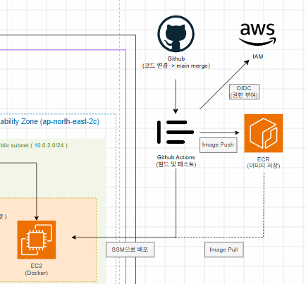

# project05
~ Kubernetes 없이 최소 비용으로 어디까지 안정적인 서비스 운영 환경을 구성할 수 있을까 ~

단일 EC2 + Docker 환경에서 시작하여 실제 부하 및 장애 상황을 검증하고, Cloudwatch, ALB, Auto scling, RDS 및 CI/CD를 단계적으로 추가하며 "비용과 안정성 사이의 적절한 인프라 구조를 찾아자는 프로젝트" 입니다.

처음부터 완성된 고가용성 환경을 구축하는 대신,
- 문제 발견 -> 개선 -> 검증 -> 비용 비교

과정을 반복하여 각 인프라 구성 요소가 왜 필요한지 확인하는 것을 목표로 삼았습니다.

---
## 이 프로젝트는

### 목표
- k8s 없이 소규모 서비스를 운영할 수 있는 AWS 인프라 구성
- 최소 비용의 단일 EC2 환경에서 시작
- 실제 부하 및 장애 테스트를 통한 한계 확인
- terraform을 통한 IaC 구성
- 최종적으로 비용 증가와 안정성 향상 효과 비교

### 핵심은
" 가장 저렴한 인프라가 항상 가장 좋은 인프라인가 "

단일 EEC2 구조는 매우 저렴하지만 장애 대응, 확장성, 모니터링, 데이터 관리에 한계가 있습니다.

반대로 모든 고가용성 기능을 처음부터 적용해버리면 소규모 서비스에는 과도한 비용이 발생할 수 있습니다.

본 프로젝트에서는 두 갈등 사이에서 "실제 운영에 필요한 기능과 그에 따른 비용을 직접 비교" 했습니다.

---
## 개선 과정
프로젝트는 가장 단순한 구조에서 시작하려 단계적으로 개선했습니다.

v1 EC2 + Docker | 최소 서비스 실행 환경 구축
v2 Load / Failure test | 단일 EC2 구조의 한계 확인
v3 Cloudwatch | 서버 상태 및 장애 탐지
v4 ALB + ASG | 서버 장애 및 트래픽 증가 대응
v5 RDS PostgreSQL | 데이터 계층 분리 및 백업
v6 Github Actions + ECR + SSM | 수동 배포 제거
v7 Final Architecture | 비용과 안정성 trade-off 분석
Cost Analysis | AWS 계산기를 이용한 비용 비교

## 초기 아키텍처
초기에는 최소 비용으로 서비스를 실행하기 위해 단일 EC2 구조를 사용했습니다

```text
User -> EC2 -> Docker Container
```

### 장점
- 구조가 단순함
- 구축 및 운영이 쉬움
- 비용이 매우 낮음

### 확인된 한계점
- EC2 장애 시 서비스 전체 중단
- 트래픽 증가 시 확장 불가
- 서버 상태를 직접 접속하여 확인해야함
- 데이터 계층과 애플리케이션 서버의 분리 부족
- 애플리케이션 배포 시 수동 작업이 필요함

이러한 문제를 이후 단계에서 하나씩 개선했습니다.

## 최종 아키텍처
최종 구조는 다음과 같습니다


아래를 보시면
RDS DB Subnet Groupt은 두 Availability Zone을 사용하지만,
비용 절감을 위해 실제 DB 인스턴스는 Single-AZ로 구성했습니다

## IaC
모든 주요 AWS 인프라는 terraform으로 관리했습니다

### 주요 리소스
- VPC
- Internet Gateway
- Public Subnet
- DB Private Subnet
- Route Table
- Security Group
- Application Load Balancer
- Target Group
- Launch Template
- Auto Scaling Group
- Cloudwatch Alarm
- RDS PostgreSQL
- ECR
- IAM Role
- Github OIDC Provider

이를 통해 콘솔에서 수동으로 인프라를 구성하는 대신

```bash
terraform init
terraform fmt
terraform validate
terraform plan
terraform apply
terraform destroy
```

과정을 통해 동일한 환경을 재현할 수 있도록 구성했습니다.

---
## Monitoring
초기 환경에서는 서버 상태를 확인하기 위해 EC2에 직접 접속해야 했습니다.

이를 개선하기 위해 Amazon Cloudwatch와 Cloudwatch Agent를 구성했습니다.

### Monitoring Metrics

- CPU Usage
- Memory Usage
- Disk Usage

```text
EC2
 |
 | Cloudwatch Agent
 ▼
Amazon Cloudwatch
 |
 ▼
Cloudwatch Alarm
```

CPU는 EC2 기본 Metric을 사용하고, Memory와 Disk는 Cloudwatch Agent를 통해 추가 수집했습니다.

이를 통해 장애가 발생한 이후 확인하는 방식에서
"문제가 발생하는 시점을 모니터링하고 탐지할 수 있는 구조"
로 개선했습니다.

---
## Load / Failure test
단일 EC2 구조의 한계를 확인하기 위해 실제 부하 테스트를 진행했습니다.

### CPU Load test
부하 발생 중 'vmstat1'을 통해 CPU 사용율 변화를 확인했습니다.

```text
us : 약 50%  |  사용자 프로세스의 cpu 사용률
sy : 약 1 ~ 3%  |  커널 영역의 cpu 사용률
id : 약 46 ~ 49%  | cpu 유휴 시간
```

이를 통해 단일 서버가 처리 가능한 범위와 서버 자원에 직접 의존하는 구조의 한계를 확인했습니다.

### Container Failure
Docker Container를 직접 중지하여 애플리케이션 장애 상황을 발생시켰습니다.

단일 EC2 환경에서는 Container 또는 instance 장애가 즉시 서비스 장애로 이어질 수 있다는 점을 확인했습니다.

---
## Load Balancing / Auto Scaling
단일 EC2 장애와 트래픽 증가 문제를 개선하기 위해
Application Load Balancer와 Auto Scaling Group을 추가했습니다.

### Auto Scaling Policy

```text
Minimum Capacity : 1
Maximum Capacity : 2
```

평상 시에는 최소 1대만 운영하여 비용을 낮게 유지하고, cpu 사용률이 증가할 경우에만 추가 인스턴스를 생성하도록 구성했습니다.

### Scale out test
부하 테스트를 통해 실제 Scaling 동작을 검증했습니다.

```text
Normal State

Desired Capacity
1
```

부하 증가 이후 :

```text
High CPU load

Desired Capacity
1 -> 2
```

새로운 EC2가 생성되고 ALB target으로 등록되는 것을 확인했습니다.

즉, 트래픽 증가로 cpu 사용량이 급증하면서 Auto Scaling 정책 임계치에 도달하여 EC2가 늘어나는 것을 확인할 수 있었습니다.

## DB

애플리케이션과 데이터 계층을 분리하기 위해 Amazon RDS PostgreSQL을 추가했습니다.

### 설정

```text
engine : PostgreSQL
instnace : db.t4g.micro
deployment : Single-AZ
Storage : gp3 20GB
Backup : 7days
```

RDS는 외부에 직접 노출하지 않고 DB Private Subnet 영역에 구성했습니다.

### Single-AZ를 선택한 이유
Multi-AZ는 장애 대응 능력을 높힐 수 있지만
Standby Database 운영에 따른 추가 비용이 발생합니다.

본 프로젝트에서는 소규모 서비스와 비용 절감을 가정하여
"완전한 HA보다 비용과 데이터 관리 편의성 사이의 균형"
을 우선시 했습니다.

### backup
RDS 자동 백업 보존 기간은 '7일'로 구성했습니다.

이를 통해 EC2내부에 직접 DB를 운영하는 것보다 백업과 데이터 관리 부담을 줄였습니다.

## CI/CD
초기에는 애플리케이션 변경 시 EC2에 직접 접속하여 Docker Image를 갱신하고 Container를 다시 실행해야 했습니다.

이를 Github Actions 기반 자동 배포로 개선했습니다.

### Deployment Flow



### OICD
AWS Access key를 Github Secrets에 장기간 저장하는 대신 Github Actions OIDC Provider와 IAM Role을 사용했습니다.

```text
Github Actions
       |
       |
       ▼
AWS IAM Role
```

이를 통해 장기 AWS Credential 관리 부담을 줄였습니다.

### ECR
Github Actions에서 Docker Image를 build한 후 Amazon ECR Private Repository에 push 합니다.

```text
Source code
     |
     ▼
Docker build
     |
     ▼
Amazon ECR
```

ECR에는 Lifecycle Policy를 설정해서 오래된 image가 무제한으로 쌓이지 않도록 구성했습니다.

### SSM
Github Actions에서 AWS Systems Manager를 사용하여 ASG에 속한 EC2에 배포 명령을 전달했습니다.

EC2는 최신 image를 ECR에서 pull한 뒤 Docker Container를 재실행합니다.

이를 통해 배포 과정에서 직접 ssh 접속이 필요하지 않도록 개선했습니다.

---
## 배포 검증
Github Actions workflow를 실행하여 전체 자동 배포 과정을 검증했습니다.

```text
Github push
     |
     ▼
Github actions
     |
     ▼
Docker build
     |
     ▼
ECR push
     |
     ▼
SSM SendCommand
     |
     ▼
EC2 image pull
     |
     ▼
Docker Container Restart
```

배포 완료 후 SSM을 통해 대상 EC2에서 'docker ps'를 실행하여
최신 Container가 정상적으로 실행되는 것을 확인했습니다.

---
## 비용 분석
AWS Pricing Calculator를 사용하여 최종 구조를 한달 동안 운영한다고 가정한 예상 비용을 계산했습니다.

### 비용 기준
- region : ap-northeast2 (seoul)
- pricing : On-Demand
- 한달 사용 기준 : 약 730시간
- 평상시 EC2 1대
- ALB 소규모 트래픽 가정
- RDS Single-AZ
- ECR 소규모 Image Storage(1GB)
- 실제 청구 비용이 아닌 예상 비용

### 최종 아키텍처 기준
월별 예상 비용
- EC2 | $9.49
- ALB | $16.66
- RDS | $20.87
- Cloudwatch | $0.60
- ECR | $0.10
= Total 약 $47.72/1달

> 일부 데이터 사용량 및 실제 워크로드에 따라 달라질 가능성 있음

### 초기 vs 최종

```text
초기
예상 월 비용 약 $10 :
EC2
```

```text
최종
예상 월 비용 약 $48 :
EC2
ALB
ASG
Monitoring
Alarm
Managed DB & backup
CI/CD
```

최종 구조는 초기 구조보다 약 4~5배의 비용이 발생하지만, 단순히 서버 성능을 높힌 비용이 아닙니다.

추가 비용을 통해 다음 운영 기능을 확보했습니다 :
- 장애 탐지
- Load Balancing
- Auto Scaling
- 데이터 계층 분리
- 자동 backup
- Container Registry
- CI/CD
- ssh없는 원격 배포

특히 최종 구조에서는 EC2 자체보다 'ALB와 RDS'가 전체 비용에서 가장 큰 비중을 차지했습니다.

이를 통해 "서비스 안정성과 관리 편의성을 확보하기 위한 Managed Service 역시 중요한 비용 요소" 라는 점을 확인했습니다.

> 자세한 비용 분석은 cost_analysis.md

## 본 프로젝트 핵심

### k8s를 사용하지 않은 이유
본 프로젝트의 목표는 k8s를 사용하는 것이 아니라,
"소규모 서비스에서 k8s없이 어디까지 안정적인 운영 구조를 만들 수 있는가"
를 검증하는 것이었습니다.

ALB, ASG, Docker, RDS, Cloudwatch와 같은 AWS 서비스를 조합하여 보다 단순한 환경에서도 기본적인 확장성과 운영 기능을 확보했습니다.

### ASG Minimum 1
평상 시 여러 대의 EC2를 항상 실행하면 안정성은 높아지지만 유휴 시간에도 비용이 계속 발생합니다.
따라서
```text
min = 1
max = 2
```
로 구성하여 평상 시 비용을 최소화하고 필요할 때만 추가 instance를 생성하도록 했습니다.

### Nat Gateway 미사용
Nat Gateway는 편리하지만 소규모 환경에서도 고정 비용이 발생할 수 있기 때문에 본 프로젝트에서는 비용으로 고려하여 사용하지 않았습니다.

---
## 트러블슈팅
프로젝트 진행 과정에서 단순 구축뿐 아니라 실제 오류를 해결하고 원인을 기록했습니다.

### terraform resource reference error
Route Table에서 Internet Gateway를 참조했지만
해당 Resource 선언이 누락되어 'terraform validate'가 실패했습니다.

```text
Refernece to undeclared resource
aws_internet_gateway.main
```

Internet Gateway Resource를 추가하여 해결했습니다.


### Cloudwatch
Cloudwatch Agent에서 Metric 수집은 정상적이었지만 초기 대시보드에서는 그래프가 정상적으로 표현되지 않는 문제가 있었습니다.

Metric 수집 상태와 시간 범위를 확인한 뒤 cpu / memory /disk Metric이 정상적으로 표시되는 것을 확인했습니다.


### Auto Scaling Verification
Auto Scaling Policy를 생성하는 것만으로는 실제 Scaling이 동작하는지 확인할 수 없었습니다.

cpu 부하를 발생시키고
```text
Desired Capacity
1 -> 2
```
변화를 직접 확인하여 Scaling 정책을 검증했습니다.


### Github Actions Deployment
Github Actions 자동 배포 과정에서 workflow 실패를 확인하고 배포 과정을 수정한 뒤 workflow를 다시 실행했습니다.

최종적으로 SSM를 이용하여 EC2에서 'docker ps'를 확인함으로서 배포 완료 여부를 검증했습니다.

---
## 기술 스택

### Cloud
- AWS EC2
- Application Load Balancer
- Auto Scaling Group
- Amazon RDS PostgreSQL
- Amazon Cloudwatch
- Amazon ECR
- AWS Systems Manager
- AWS IAM

### IaC
- Terraform

### Container
- Docker

### CI/CD
- Github Actions
- Github OIDC
- Amazon ECR
- AWS SSM

### OS / Environment
- ubuntu
- WSL

---
## 한계점
본 프로젝트는 비용 절감을 우선하여 완전한 고가용성 환경을 구성하지 않았습니다.

### RDS Single-AZ
RDS 장애 시 다른 AZ의 Standby DB로 자동 Failover되는 구조가 아닙니다.

서비스 중요도가 증가하면 다음과 같은 개선이 가능합니다.
```text
RDS Single-AZ -> RDS Multi-AZ
```

### Auto Scaling Capacity
현재 최대 instance 수는 2대로 제한되어 있습니다.

실제 서비스에서는 트래픽 패턴과 부하 테스트 결과를 기반으로 Scaling 기준을 다시 설정해야 합니다.

### Single Region
모든 리소스가 'ap-northeast-2'에 존재하므로 Region 전체 장애에는 대응할 수 없습니다.

보다 높은 수준의 장애 대응이 필요한 경우
- Multi-Region
- Disaster Recovery
- Cross-Region Backup

등을 고려할 수 있습니다.

당연히 막대한 비용 지출이 예상됩니다.

---
## 결과
프로젝트 초기 구조는 다음과 같았습니다.

```text
EC2 + Docker
```

단계적인 개선 이후 최종적으로

```text
Terraform + ALB + Auto Scaling Group + EC2 / Docker + Cloudwatch + RDS PostgreSQL + ECR + Github Actions + OIDC + AWS SSM
```

환경을 구성했습니다.

단순히 AWS 서비스를 많이 사용하는 것을 목표로 하지않고, 각 단계에서 기존 구조의 문제를 확인한 뒤 그 문제를 해결할 수 있는 기능을 추가했습니다.

결과적으로
- 서비스 상태 모니터링
- 장애 탐지
- 서버 자동 확장
- Load Balancing
- 데이터 계층 분리
- 데이터 자동 백업
- Container Image 관리
- 자동 배포
가 가능한 기본적인 서비스 운영 환경을 구성했습니다.

### 결론
본 프로젝트에서 확인한 가장 중요한 점은
"안정성은 무료가 아니며, 최저 비용만을 목표로 하는 것은 또한 항상 좋은 선택이 아니다."
라는 겁니다.

단일 EC2 환경은 약 월 $10 수준으로 저렴했지만 
장애 대응과 확장성에 한계가 있었습니다.

반면에 최종 환경은 약 월 $48 수준으로 비용이 배로 증가했지만
모니터링, 자동 확장, 데이터 분리, 백업, 자동 배포 등의 운영 기능을 확보했습니다.

따라서 인프라 설계할 때 중요한 점은
**가장 저렴한 구조 또는 가장 안정적인 구조를 선택하는 것이 아니라,
서비스 규모와 장애 허용 수준에 맞춰 필요한 비용을 선택하는 것**
이라고 판단했습니다.

본 프로젝트는 이를
- 문제 발견 -> 개선 -> 검증 -> 비용 비교

과정을 통해 직접 확인하는 것을 목표로 진행했습니다.

---
## 문서화

프로젝트의 각 단계별 구현 및 검증 과정은 별도 문서로 기록했습니다.
v1_base.md | EC2 + Docker 기본 환경
v2_test.md | 부하 및 장애 테스트
v3_monitoring_alarm.md | Cloudwatch Monitoring
v4_alb_asg.md | ALB + Auto Scaling
v5_rds_backup.md | RDS PostgreSQL
v6_cicd.md | Github Actions CI/CD
v7_final.md | 최종 아키텍처 + 결과
cost_analysis.md | 초기 & 최종 비용 비교

---
## 프로젝트 요약

```text
최소한의 인프라 (EC2 + Docker)
        │
        ▼
 부하 / 장애 테스트
        │
        ▼
     모니터링
        │
        ▼
고가용성 & scaling
        │
        ▼    
      DB RDS
        │
        ▼
      CI/CD
        │
        ▼
    비용 비교
```

서비스에 필요한 안정성을 확보하면서
불필요한 비용을 줄이는 것이 이 프로젝트의 목표입니다.


