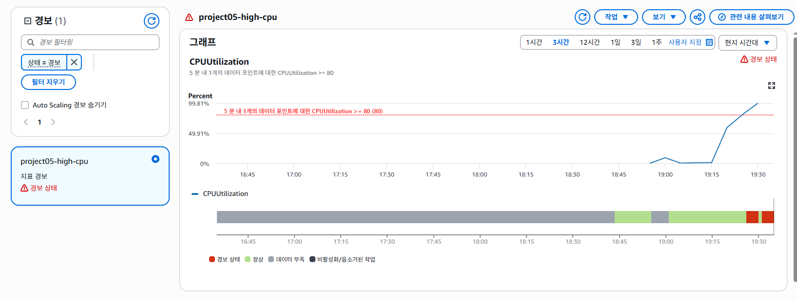
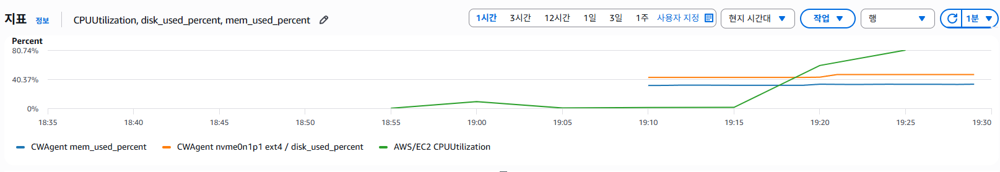

## 목표
기존 base의 단일 EC2 환경에서는 장애나 리소스 이상이 발생해도 운영자가 직접 서버에 접속하여 상태를 확인해야했음
이번 단계에서는 AWS CloudWatch를 도입하여 EC2의 주요 리소스를 외부에서 모니터링하고, 일정 임계치를 초과할 경우 CloudWatch Alarm을 통해 이상 상태를 탐지할 수 있도록 개선함

## 기존 문제점
v2의 부하 테스트를 통해 단일 EC2의 CPU사용률이 크게 상승하는 상황을 확인할 수 있었음
그런게 그 상황도 테스트하는 입장이라서 볼 수 있던 것

- cpu / memory / disk 상태를 확인하려면 직접 ssh타고 들어가야함
- 장애 및 이상 탐지가 자동으로 안됨
- 위에 이상 탐지라고 적어놨지만 이상 탐지의 기준이 없음
- 문제 발생 후에 수동으로 원인 해결 가능

이번 단계에서는 장애 해결 이전의 "장애 및 이상 상태를 탐지할 수 있는 환경구성" 임

## 구성 변경점

기존 base 구성에 Cloudwatch Agent 추가
userdata.sh로 초기 프로비저닝 시에 설치되도록 구성
아래에 Terraform 으로 서술

##  Cloudwatch Agent

EC2 기본 Cloudwatch Monitoring에는 cpu 등의 기본 메트릭을 확인할 수 있지만, memory와 disk 사용률 등은 기본적으로 제공되지않음

따라서 다음과 같이 메트릭 수집을 구성

CWAgent
- mem_used_percent / 1분
- disk_used_percent / 1분
+
제공되는 Free tier cpu 수집기능 / 5분

## Terraform
추가/수정된 파일
terraform/
- ec2.tf - iam 설정 추가
- iam.tf - EC2용 IAM Role 생성
- ssm.tf - Cloudwatch Agent 설정을 SSM Parameter Store에 저장
- cloudwatch.tf - cpu / memory / disk alarm 관리
- cloudwatch-agent-config.json - 위에 서술된 메트릭 수집 구성 (memory / disk)
- user_data.sh - docker, nginx + Cloudwatch Agent 설치

## Cloudwatch Alarm
다음 3개의 alarm 생성

- project05-high-cpu // cpu >= 80%
- project05-high-memory // memory >= 80%
- project05-high-disk // disk >= 80%

## CPU 부하 검증
테스트 도구는 stress 사용
stress-ng --cpu2 --timeout 600s --metrics-brief

테스트 전에는 v2에서와 같이 cpu 사용률이 매우 낮은 상태였으나, 부하 후 다음과 같이 상승함

약 1% -> 약 1% -> 약 1% -> 약 1%

상승함에 따라 다음 알람이 정상 작동을 확인
- project05-high-cpu // OK -> ALARM

### 결과 
- cpu 부하 발생 확인
- Cloudwatch cpu metric 상승 확인
- cpu 80% 임계치 도달/초과 확인
- 임계치 초과에 따라 OK -> ALARM 전환 확인

## 트러블슈팅
Cloudwatch Agent 자동설치 실패

재정적인 문제로 인해 프로젝트 진행 중에 몇번이고 apply/destroy를 진행함
watch 구현해놓고 다음날 apply로 프로비저닝을 했지만 watch 데이터 수집이 안됨
그래서 로그 확인한 결과
- status: error
원인은 
- dpkg: error: dpkg frontend lock was locked by another process
EC2 초기화 과정에서 다른 패키시 설치 프로레스가 dpkg를 사용하고 있는 상태에서 Cloudwatch Agent를 설치하려고 하니 충돌이 발생해버린것

userdata.sh에서 기존의
- dpkg -i -E ./amazon-cloudwatch-agent.deb
이를 패키지 lock이 해제될 떄까지 대기하도록 수정
apt-get -o DPkg::Lock::Timeout=300 install -y ./amazon-cloudwatch-agent.deb

이러한 결과로 프로비저닝 사이에 패키지 설치 프로세스가 겹쳐도 최대 300초 대기 후 설치하도록 개선

## 개선 결과
기존 v2에는

장애 / 부하 발생 -> 서비스 이상 -> ssh 접속 -> vmstat 등 확인 -> 원인 파악
이었다면,

이번 v3에는

장애 / 부하 발생 -> CloudWatch metric 수집 -> 임계치 초과 -> Cloudwatch ALARM -> 운영자가 이상 상태 확인

직접 ssh로 들어가지 않아도 EC2의 cpu, memory, disk 상태를 확인가능하며, 설정된 임계치를 기준으로 이상탐지가 가능해짐

