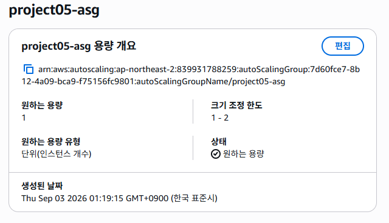
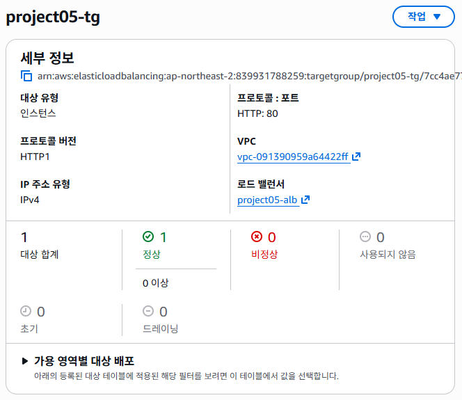
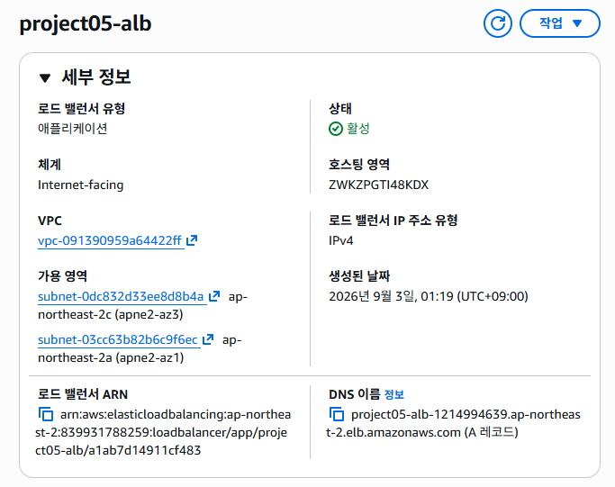
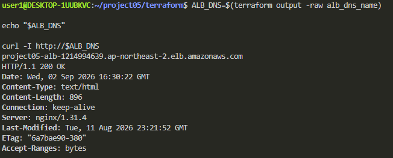
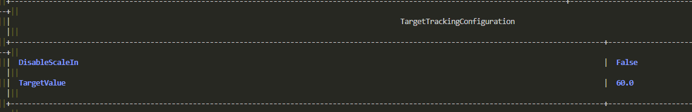
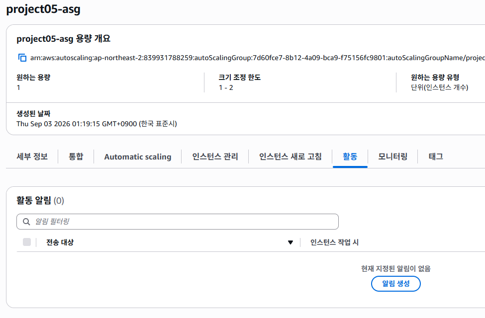
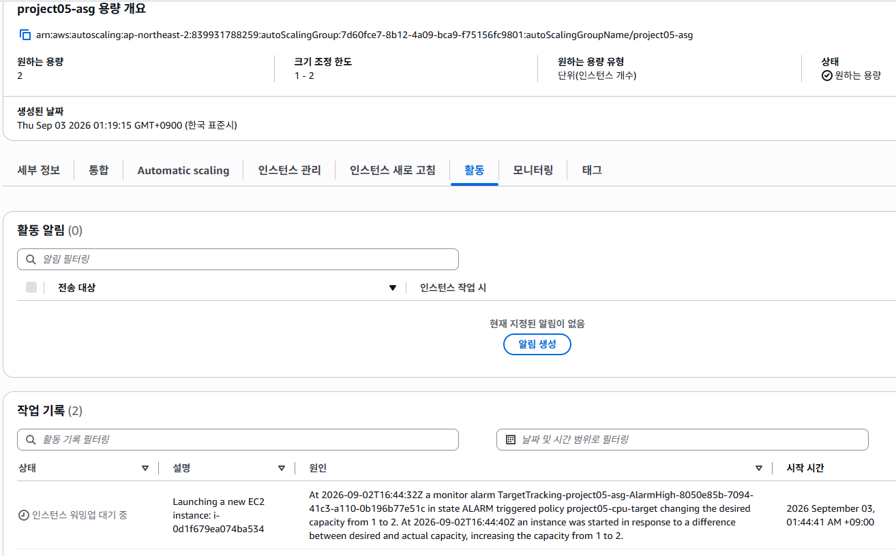
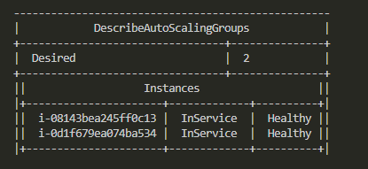
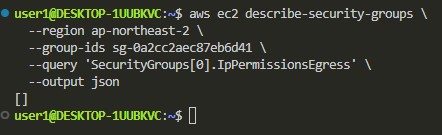

## 기존 문제점
기존 단일 EC2 구조에서는 서버 장애가 발생하면 서비스가 전체 중단되고 트래픽 증가 시에도 수동으로 서버를 추가해야하는 한계가 존재

## 목표
v3에서 Cloudwatch를 통해 서버 상태와 이상 탐지를 할 수 있도록 개선했지만,
장애 발생 이후의 복구 및 확장 작업은 여전히 수동 대응이 필요했음

이번 단계에서는 ALB와 ASG를 도입하여
- EC2 장애 시 자동 복구
- 정상 인스턴스로 트래픽 전달
- cpu 부하에 따른 자동 scale out
- 평상 시 EC2 1대를 유지하여 비용 최소화
를 목표로 함

## 구성 변경점
ALB구성을 위해 기존 ap-northeast-2a public subnet에 ap-northeast-2c public subnet 추가
ASG는 Launch Template를 기반으로 EC2를 생성하고, 생성된 instance는 자동으로 Target Group에 등록됨

## ALB
- Internet-facing Application Load Balancer
- HTTP :80 Listener
- Target Group HTTP :80
- / 경로 Healthy Check
- 2개의 AZ(2a, 2c)사용

## ASG
min : 1
desired : 1
max : 2
평상 시에 1대만 유지하고 필요한 경우만 2대까지 확장하도록 구성

### Launch Template
기존 단일 EC2 설정을 Launch Template로 이전
새로운 EC2가 생성되더라도 user_data.sh를 통해
Docker와 Nginx를 자동으로 설치되도록 구성

## SG변경
기존에 EC2의 HTTP 80번 포트가 인터넷에 직접 공개되어있엇ㅆ음

ALB 도입 후에는 ALB와 EC2 SG를 분리함
ASG EC2의 HTTP 접근은 ALB SG에서 오는 요청만 허용하도록 제한
= 사실상 ASG를 구성하면 ALB가 따라와야하는 구조가 됨

## ALB 검증

## 자동 복구 검증

ASG가 관리하는 EC2 인스턴스를 강제 종료하여 장애 상황 재현
기존 EC2는 Terminating / Unhealthy를 보였고
이후 ASG가 Desired Capacity 1을 유지하기 위해 새로운 EC@ 자동 생성
새 EC2 -> InService / Healthy
요청 결과도 HTTP/1.1 200 OK
정상적으로 서비스가 복구되는 것 확인

EC2 장애 -> ASG 장애감지 -> 새 EC2 자동 생성 -> Launch Template 적용(nginx) -> Target Group 등록 -> 서비스 복구

## cpu 기반 Auto scaling
cpu 부하 증가 시 자동으로 EC2를 확장하도록 TargetTrackingScalingPolicy 추가

설정은
Metric : ASGAverageCPUUtilization
TargetValue : 60%
Scale In : Enabled

## 트러블슈팅
ALB 생성 후 ALB DNS로 접근했지만
504 Gateway Time-out 발생

Target Group 상태 확인 결과가
State : unhealthy
reason : Target.Timeout
Description : Request timed out
ALB 에서 target으로 요청이 정상적으로 전달되지 않는 상태

EC2 내부 app에서 로그를 긁어봤지만
cloud-init : done
Docker : active
Nginx : Up
localhost : HTTP 200 OK
그리고 private ip로 ssh 접근해도 정상 동작했음

이후 SG도 점검
ASG EC2 SG의 HTTP inbound는 정상적으로 허용되었지만
egress 즉 outbound rule이 없었음

따라서 ALB SG에 target으로 향하는 HTTP egress를 추가
= 수정 후에 정상 작동 확인함

## 개선 결과
기존에 단일 EC2에서 장애가 발생하면 서비스 중단에 트래픽 증가를 수동으로 대응해야했다면,
이번 개선으로 ALB와 ASG(Launch Template, Target Tracking Scaling)추가

결과적으로
- ALB를 통한 서비스 접근 성공
- Target Group Health Check 정상
- EC2 장애 시 scale out 성공
- 복구 이후 HTTP 200 OK
- cpu 부하 시 desired 1 -> 2 확장 성공
- desired 2 모두 healthy 확인

장애 대응 및 트래픽 대응 능력이 개선됨
