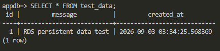
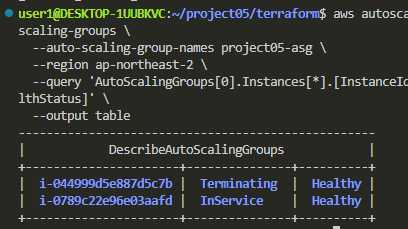
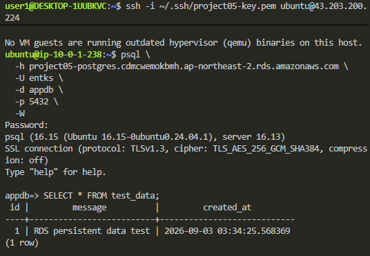
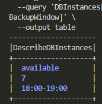
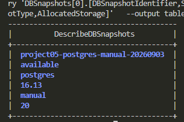

## 목표
v4에서 ALB와 ASG를 구성하여 EC2 장애 및 트래픽 증가에 대응가능하도록 개선함

하지만 EC2는 scaling과정에서 언제든 생성/삭제될 수 있기 때문에 app data까지 EC2 내부에 저장할 경우 교체됨에 따라 data가 사라질 수 있음

따라서 이번에는 app server와 data 층을 분리하기 위해 RDS를 도입

- EC2와 DB의 생명주기 분리
- private RDS 구성
- EC2 교체 이후에도 데이터 유지 확인
- 자동 백업 및 수동 snapshot 구성
- 비용을 고려한 single-AZ RDS 사용

## RDS
비용을 최소화 하면서 관리형 DB의 장점을 활용하기 위해 RDS를 선택

engine : PostgreSQL 16
instance class : db.t4g.micro << 필요 시 증강
storage : gp3 20GB << 마찬가지로 필요 시 증강
multi-AZ : false
public access : false
backup retention : 7
port : 5432
database name : appdb
 
RDS는 외부 인터넷 접근을 막기 위해 private subnet에 배치
또한 5432포트를 전체 개방하지 않고 ASG target이 사용하는 SG에서 들어오는 트래픽만 허용

## EC2 -> RDS 연결 검증
ASG에서 scale out된 EC2에 ssh 접속 후 PostgreSQL Client를 이용하여 private RDS에 접속

psql \
  -h <RDS_ENDPOINT> \
  -U entks \
  -d appdb \
  -p 5432 \
  -W

RDS 접속 성공 및 SSL 연결 확인됨

테스트를 위해 다음의 데이터를 저장

CREATE TABLE test_data (
    id SERIAL PRIMARY KEY,
    message VARCHAR(100),
    created_at TIMESTAMP DEFAULT CURRENT_TIMESTAMP
);

INSERT INTO test_data (message)
VALUES ('RDS persistent data test');

SELECT * FROM test_data;

조회 결과로 데이터 정상 저장 확인

## EC2 교체 후 data 영속성 검증
RDS 도입 목적 중 하나는 EC2의 생명주기와 data의 생명주기를 분리하는 것

이를 검증하기 위해 기존 ASG target을 강제 종료
...
desired capacity를 유지한 상태에서 기존 EC2를 종료했기 때문에
ASG가 새로운 EC2를 자동생성

확인 결과로 아래의 사진과 같이 기존 instance는 terminating, 새로운 instance가 InService 상태

## 신규 EC2에서 기존 data 확인
새로 생성된 EC2에 접속해서 동일한 RDS endpoint로 연결
이후 다른 data작업 없이 바로 테이블 조회
결과로 정상적인 테이블 조회됨
= 기존 EC2에 저장했던데이터가 그대로 유지되고 있음을 확인

따라서 EC2가 교체되어도 data는 RDS에 독립적으로 저장되며 양향을 받지 않는 것을 확인

## RDS 자동 백업 설정
데이터 손실에 대비하기 위해 RDS automated backup을 활성화
백업 보존 기간은 7일로 설정

## Snapshot 생성
자동 백업과는 별도로 특정 시점의 복구 지점을 확보하기 위한 Manual Snapshot생성

aws rds create-db-snapshot \
  --db-instance-identifier project05-postgres \
  --db-snapshot-identifier project05-postgres-manual-20260903 \
  --region ap-northeast-2

생성 결과

정상적인 생성 확인과 복구 가능 상태(available)확인

## 트러블슈팅
처음에 RDS 빌드할 때 16.6으로 시작
plan에서는 문제가 없었지만 apply에서 문제발생
-> InvalidParameterCombination 오류

서울 리전에서는 PostgreSQL 16.6 버전을 이용할 수 없다고 함

따라서 버전 고정을 제거하고 PostgreSQL 16 Major version을 지정하여 현재 지원되는 16.13버전으로 생성

## 개선 결과
기존 구조에서는 EC2가 app과 data를 같이 담당할 경우 장애 또는 교체 시 data에 영향이 생겼지만, RDS를 별도의 data 층으로 분리함으로서 개선됨

실제 EC2 교체한 뒤에도 기존 data 유지를 확인했으며, 7일 자동 백업과 snapshot을 통해 데이터 복구 지점도 확보

이번 단계에서는 비용 절감을 우선하여 Multy-AZ : false = Single-AZ 사용

v4에서 확보한 Auto Scaling과 더불어 v5에서는 data 층을 독립시키고 데이터 영속성과 백업 기능을 추가함