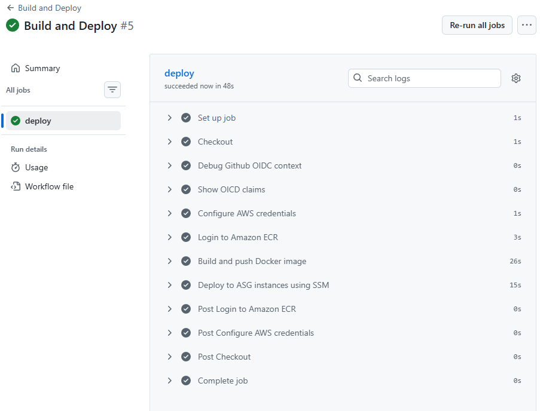
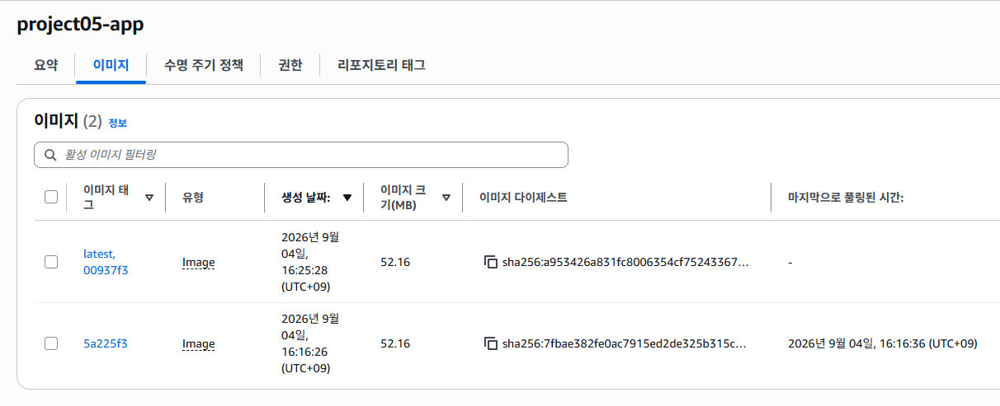
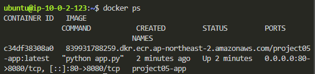
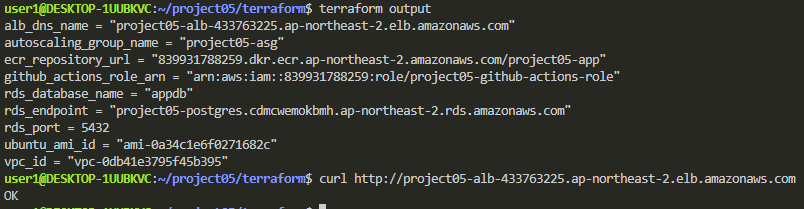
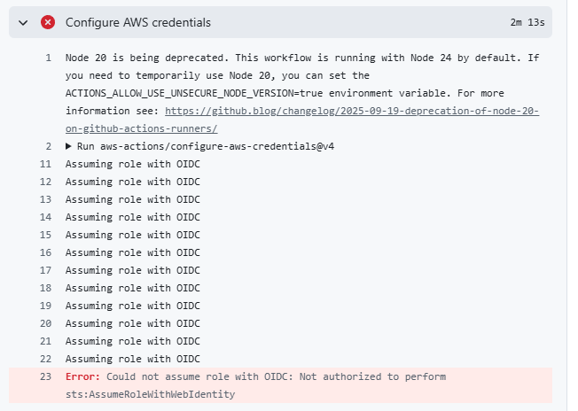

## 목표
이전 구성에서는 app 변경 시 EC2에 직접 접속해서 docker image를 교체해야했음

ASG를 통해 서버 장애와 트래픽 증가에 대응이 가능했지만, app 배포 과정은 여전히 수동 작업이었음

이번 단계에서는
- EC2 직접 접속 없이 app 배포
- docker image 중앙 관리
- AWS Access key를 저장하지 않는 github 인증
- ASG target에 동일한 app 버전 배포
- 코드 변경부터 실제 서비스 반영까지 자동화

## Github Actions
main branch에서 app 또는 workflow가 변경되면 CI/CD pipeline이 실행 되도록 구성

Checkout
- AWS Credential 설정
- ECR Login
- Docker image build
- ECR Push
- SSM을 통한 ASG 배포

수동 검증을 위해 workflow_dispatch도 구성

## Github OIDC
Github Actions에 장기 AWS Access key를 저장하지 않고 OIDC를 이용하여 AWS IAM Role을 Assume하도록 구성

Github Actions -> AWS IAM -> project05-github-actions-role
          (OIDC Token)      

role에는 배포에 필요한 최소 권한 부여
- ECR image push
- EC2 instance 조회
- SSM SendCommand
- SSM Command 결과 조회

## Amazon ECR
app docker image를 ECR에 저장하도록 구성

하나의 빌드에 두 종류의 tag
project05-app:latest
project05-app:commit SHA

latest를 app 배포에 사용하고 아래 SHA태그는 어떤 commit으로 image가 생성되었는지 버전 관리를 위해 구분

추가로 Lifecycle Policy를 적용하여 오래된 이미지는 자동으로 정리하고 최근 5개의 이미지만 유지하도록 구성

## SSM 기반 원격 배포
EC2에 직접 ssh 접속하지 않고 AWS Systems Manager의 AWS-RunShellScript를 이용하여 배포하도록 구성

각 ASG target에서 다음 작업을 실행:
ECR Login
- latest image pull
- 기존 nginx/project05.app 제거
- 신규 project05-app container 실행

EC2에는 다음 IAM 권한 부여
- AmazonSSMManagedInstanceCore
- AmazonEC2ContainerRegistryReadOnly

## 신규 ASG target 처리
Auto Scaling으로 새로운 EC2가 생성되는 경우데도 동알한 app을 실행할 수 있도록 Launch Template의 Userdata를 수정

EC2 생성
- Docker 설치
- AWS CLI v2 설치
- ECR latest 확인
  - 존재 시 project05-app 실행
  - 미존재 시 nginx 임시 실행
- Cloudwatch Agent 실행

따라서 CI/CD 이후에 새롭게 생성되는 instance도 ECR의 최신 app image 사용 가능

## 배포검증
github actions
ECR image
EC2 container
ALB DNS 응답

## 트러블슈팅
### Github OIDC 인증 실패
Github Actions의 AWS Credential 단계에서 다음 오류가 발생

Could not assume role with OIDC:
Not authorized to perform
sts:AssumeRoleWithWebIdentity

IAM Role의 Trust Policy 자체는 정상적으로 설정되어 있었지만 GitHub가 실제 발급하는 OIDC Token의 sub Claim과 Trust Policy의 조건이 일치하지 않음

실제 OIDC Claim을 workflow에서 확인:
sub=repo:sor21101@<OWNER_ID>/project05@<REPOSITORY_ID>:ref:refs/heads/main
aud=sts.amazonaws.com

기존 IAM Trust Policy에서는 Github owner 및 repo의 ID가 포함되지 않은 값을 사용하고 있었음

terraform에 다음 값을 추가:
github_owner_id
github_repo_id

그리고 IAM Trust Policy의 sub조건을 실제 Github OIDC Claim과 일치하도록 수정

repo:<OWNER>@<OWNER_ID>/<REPOSITORY>@<REPOSITORY_ID>:ref:refs/heads/main

수정 후 actions에서 AWS IAM Role Assume이 정상 수행됨

### SSM 배포 실패
OIDC 문제 해결 후 SSM을 통한 배포 단계에서 또 오류 발생

SSM Commend 결과:
aws: not found
docker: not found

Github Actions 그리고 SSM 연결 자체는 정상적으로 수행됨
하지만 EC2내부에서 aws와 docker 명령을 수행할 수 없었기 때문에 EC2 초기 설정 문제라고 생각함

Launch Template의 Userdata 싪행 과정에서 AWS CLI와 docker가 정상적으로 준비되지 않음을 확인

이 문제로 초기 nginx container도 실행되지 않아 ALB target이 unhealthy상태가 되며 502 bad gateway가 발생

Userdata를 수정하여 초기화 과정을 다음과 같이 변경:
docker.io 설치
- docker service 시작
- curl / unzip 설치
- AWS CLI v2 공식 패키지 설치
- ECR Login
- container 실행

수정 후 instance를 다시 생성:
docker version 정상
AWS CLI v2 정상
nginx container up
localhost HTTP 200
ALB target healthy

actions re-run결과 SSM 배포까지 정상적으로 완료

## 개션 결과
기존에는 app 변경 시 EC2에 직접 접속해서 docker image를 교체해야했다면,
개선 후에는 github actions를 통해 자동으로 image를 빌드/저장 후 배포할 수 있도록 함

AWS Access key를 Github에 저장하지 않고 OIDC 인증을 적용하였으며, EC2에 직접 들어가지 않고 SSM을 통해 배포하도록 구성

또한 ECR을 통해 docker image를 중앙 관리하고 commit SHA tag를 사용하여 image 버전 관리/추적하도록 구성

## 한계점
현재 배포 방식은 각 EC2에서 기존 container를 제거한 후 새로운 container를 실행함
docker rm
- docker pull
- docker run

따라서 instance 단위에서는 서비스 공백이 발생함

ALB와 여러 ASG target을 사용하면 일부 영향을 완화할 수 있지만, Rolling Deployment나 Blue/Green Deployment 같은 정교한 배포 전략은 적용하지 않았음

또한 소규모/저비용 환경을 목표로 하였기 때문에 별도의 배포 플랫폼을 추가하지 않고 Github Actions + ECR + SSM 조합을 택함

