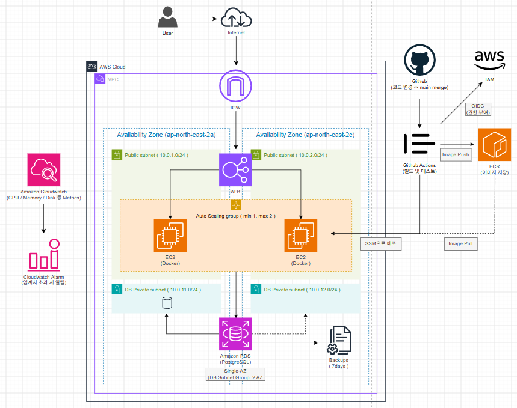

# 마지막 결과물

## 프로젝트 목표
본 프로젝트는 다음 질문에서 시작함
-> "k8s 없이 최소한의 비용으로 어디까지 안정적인 서비스 운영 환경을 구성할 수 있을까"

처음부터 완성된 고가용성 인프라가 아닌, 가장 단순한 '단일 EC2 + Docker' 환경에서 시작함

이후 실제 부하 및 장애 테스트를 통해 한계점을 확인하고 필요한 기능을 단계적으로 추가하는 방식으로 인프라를 개선함

프로젝트에서 중점적으로 확인한 항목으로:
- 최소 구성에서 실제 서비스 운영이 가능한지
- 장애 상황을 탐지할 수 있는지
- 서버 장애 및 트래픽 증가에 대응할 수 있는지
- data 층을 app server와 분리할 수 있는지
- 반복적인 배포 작업을 자동화할 수 있는지
- 안정성을 높이면서 불필요한 비용 증가를 최대한 줄일 수 있는지

## 개선 과정
프로젝트는 총 7단계로 진행함

| 단계 | 구성 | 개선 목적
-
| v1 | EC2 + Docker | 최소 비용의 서비스 실행 환경 구축 
| v2 | 부하 / 장애 테스트 | 단일 EC2 구조의 한계 확인
| v3 | Cloudwatch | 서버 상태 및 장애 탐지 개선
| v4 | ALB + ASG | 서버 장애 및 트래픽 증가 대응
| v5 | RDS | data 층 분리 및 백업 구성
| v6 | Github Actions + ECR + SSM | app 배포 자동화
| v7 | 최종 구조 및 결과 정리

처음부터 모든 서비스를 도입하지 않고

- 문제 확인 -> 개선 기능 추가 -> 동작 검증

과정을 반복함

## 최종 아키텍쳐

## 네트워크 구성
AWS ap-northeast-2 Region에 VPC 구성

### VPC
- 10.0.0.0/16
- 서비스 서버와 로드밸런서는 public subnet에 배치
- db는 별도의 db private subnet으로 분리

### Public Subnet
| AZ | CIDR 
| ap-northeast-2a | 10.0.1.0/24
| ap-northeast-2c | 10.0.2.0/24

public subnet은 다음 리소스에서 사용:
- Application Load Balancer
- ASG EC2 instance

### DB Private Subnet
| AZ | CIDR
| ap-northeast-2a | 10.0.11.0/24
| ap-northeast-2c | 10.0.12.0/24

RDS DB Subnet Group은 두 AZ의 Subnet으로 구성
다만 비용 절감을 위해 RDS자체는 Multi-AZ가 아닌 Single-AZ 구성

### Web Service
ALB
사용자 요청을 직접 EC2 한 대로 전달하는 구조에서 ALB 추가
- User -> ALB -> ASG

이를 통해 EC2에 직접 의존하지 않고 정상 상태의 서버로 요청 전달이 가능하게끔 개선

ASG
app server는 ASG로 관리
- min 1 ~ max 2

평상시에는 최소한의 instance만 운영하고 부하가 증가하면 추가 instance를 생성할 수 있도록 구성

이를 통해 항상 여러대의 EC2를 실행하는 것 보다 평상 시 비용을 낮게 유지하면서 필요할 때 확장할 수 있도록 함

Docker 
각 EC2에서 Docker Container 형태로 app 실행
- EC2 -> Docker -> app

app이랑 실행 환경을 container image로 관리하여 서버마다 동일한 환경을 재현

### Monitoring
초기 단일 EC2 구조에서는 서버 상태를 직접 접속해서 확인해야 했음

이를 개선하기 위한 Amazon Cloudwatch 사용

주요 확인 대상 : CPU / Memory / Disk 사용률

필요한 OS 수준 Metric은 Cloudwatch Agent를 통해 수집함
- EC2 -(Cloudwatch Agent)-> Cloudwatch -> Cloudwatch Alarm

특정 임계치를 초과하면 Cloudwatch Alarm이 상태 변화를 감지
이를 통해 장애가 발생한 이후 사용자가 직접 확인하는 방식에서
-> 서비스 상태를 지속적으로 확인하고 이상 상황을 탐지 가능한 구조로 개선

### Auto Scaling 검증
단순히 ASG를 생성하는 것에서 끝내지 않고 실제 부하 상황에서 scaling이 발생하는지 확인

테스트 과정에서 cpu 부하를 발생시킨 뒤
ASG의 Desired Capacity 변화를 확인

Normal -> Desired Capacity 1
High Cpu Load -> Desired Capacity 1 ... 2

추가 EC2 instance가 생성되고
ALB target으로 등록되는 과정을 확인함

이를 통해 단일 서버 구조에서 존재했던
-> 서버 자원 부족 시 서비스를 확장할 수 없는 문제 개선

### DB
초기 구조에서는 app server와 data 층의 역할이 명확하게 분리되지 않음

최종 구조에서 Amazon RDS PostgreSQL을 사용하여 DB를 EC2와 분리함
EC2 -> RDS PostgreSQL

RDS는 DB Private Subnet을 통해 구성하여 app server를 통해서만 접근할 수 있도록 네트워크 분리

RDS운영 방식
본 프로젝트에서는 비용 절감을 위해 다음 방식을 선택:
RDS PostgreSQL - Single-AZ

Multy-AZ를 적용하면 DB 장애 대응 능력이 높아지지만 비용 역시 같이 증가함

따라서 본 프로젝트에서는 
-> 고가용성을 최대화하는 것보다 소규모 서비스에서 감당할 수 있는 비용 수준을 우선하여 Single-AZ 선택

RDS 자동 백업 기능을 사용하여 7일 주기로 구성
EC2내부에 DB를 직접 운영하는 것보다 백업 및 데이터 복구 관리 부담을 줄일 수 있도록 개선

### CI/CD
초기에는 app 변경 이후 EC2에 직접 접속하여 docker container를 다시 배포

이 과정은 반복 작업이 많고 사람의 실수 가능성이 존재함
이를 개선하기 위해 Github Actions 기반 CI/CD를 구성

개발자
  |
  v
Github
  |
  v
Github Actions
  |
  +----------------------+
  |                      |        
  v                      v 
Amazon ECR            AWS SSM
  |                      |
Image Push        Deploy Command
  |                      |
  +----------------------+
         |
         v
        EC2
         |
Docker Image Pull
         |
         v
      Container

코드 변경 이후 Github Actions가 자동으로 실행

### 배포 검증
Github Actions workflow 실행 후 배포가 정상적으로 완료되는 것을 확인

이후 AWS Systems Manager를 통해 대상 EC2에서 실행 중인 container를 확인
docker ps

배포 이후 최신 Docker container가 정상적으로 실행되는 것을 확인하여
전체 자동 배포 과정이 정상적으로 동작함을 검증
Github -> Github Actions -> ECR -> SSM -> EC2 -> Docker

### 초기와 최종 구조 비교
초기 구조
장점 :
- 구조가 매우매우 단순함
- 구축이 매우매우 쉬움
- 비용이 낮음

한계점 :
- EC2 장애 시 서비스 전체 중단
- 부하 증가 시 확장 불가능 
- 장애 발생 여부를 즉시 확인하기 어려움
- server와 data 층의 의존성 높음
- 수동 배포 필요함

최종 구조
최종적으로 다음 기능을 확보
- Load Balancing
- Auto Scaling
- Monitoring
- Alarm
- Database 분리
- Database BackUp
- Container Image Registry
- CI/CD
- SSH 없는 원격 배포
- IaC 기반 인프라 관리

### 단계별 개선 효과

EC2 1대 장애         | ALB + ASG        | 새로운 인스턴스로 서비스 운영 가능
트래픽 증가           | Auto Scaling     | 필요 시 EC2 자동 확장        
서버 상태 확인 어려움 | CloudWatch       | CPU / Memory / Disk 확인 
장애 인지 지연        | CloudWatch Alarm | 임계치 기반 장애 탐지        
EC2와 DB 역할 혼합   | RDS              | 애플리케이션 / 데이터 계층 분리
데이터 손실 위험      | RDS Backup       | 7일 자동 백업               
수동 Docker 배포     | GitHub Actions   | 빌드 / 배포 자동화             
AWS Key 관리         | OIDC             | 장기 Credential 제거            
SSH 직접 접속        | AWS SSM          | 원격 명령 기반 배포       

### 비용과 안정성의 Trade-Off
프로젝트의 목표는 가장 안정적인 인프라르 구축하는 것이 아니었음
서비스의 안정성을 높이는 모든 기능에는 돈을 요구함

예시로는 다음과 같이:
EC2 1대 -> + Cloudwatch -> + ALB -> + Auto Scaling -> + RDS

단계가 증가할수록 운영 안정성은 높아지지만 동시에 AWS 비용도 증가

따라서 본 프로젝트에서는
-> 발생 가능한 운영 위험과 이를 해결하기 위한 비용을 비교하여 필요한 기능을 단계적으로 도입
하는 방식을 선택함

특히 다음 부분에서 비용을 제한:
- ASG 최소 instnace 수 1대
- ASG 최대 instnace 수 2대
- RDS Single-AZ
- k8s 제외
- Managed NAT Gateway 제외
- 필요 이상의 고가용성 구성 제외

이러한 선택은 대규모 서비스에 적합한 구조보다는
-> 트래픽 규모가 크지않은 소규모 서비스에서 비용과 운영 안정성 사이의 군형을 찾기 위한 구조
라고 볼 수 있다.

### 결과
프로젝트 초기에는
EC2 + Docker
의 단순한 구조였다면

7단의 개선을 거친 이후

ALB + ASG + EC2 / Docker + RDS + ECR + Github Actions + OIDC + AWS SSM
구조로 확장함

단순히 AWS 서비스를 덕지덕지 붙이는게 아닌 각 단계에서 기존 구조의 문제를 확인한 후 그 문제를 해결할 수 있는 서비스를 추가함

결과적으로
- 서비스 상태를 모니터링 할 수 있고
- 장애 서버를 대체할 수 있고
- data 층을 분리하여 관리할 수 있고
- data backup이 가능하며
- 코드 변경 이후 app을 자동 배포가 가능한
기본적인 서비스 운영 환경 구성

### 한계점
비용 절감을 우선했기에 본 구조가 완전한 고가용성 환경이 아님

RDS Single-AZ 
DB 장애시 자동으로 다른 AZ의 Standby DB로 전환되는 구조가 아님
서비스 중요도가 증가할 경우
Single-AZ -> Multy-AZ 전환 고려 가능

Auto Scaling Max 2
현재 Auto Scaling 범위는 소규모 트래픽을 가정하여 제한함
서비스 트래픽이 증가하면 실제 부하 패턴을 기반으로 Scaling 정책을 다시 설정해야함

단일 Region
현재 모든 서비스는 ap-northeast-2 Region에 존재함

Region 전체 장애까지 대응해야하는 서비스라면
Multy Region 혹은 다른 DR 전략이 필요함

비용과 안정성
본 프로젝트는 비용 최소화를 중요한 조건으로 설정했기 때문에 일부 고가용성 기능을 의도적으로 적용하지 않음

따라서 서비스 규모 및 중요도가 증가하면
- RDS Multi-AZ
- ASG Capacity 확대
- 추가적인 알림 체계
- 배포 전략 개선
- DR
등을 단계적으로 추가할 필요가 있음

### 결론
본 프로젝트를 통해
-> 인프라의 안정성은 처음부터 모든 기능을 추가한다고 확보되는 것이, 현재 서비스에 존재하는 위험을 확인하고 필요한 기능을 선택적으로 적용하는 과정이 중요하다
라는 점이 확인됨

가장 저렴한 단일 EC2 구조는 굼축과 운영이 간단했지만, 장애 대응과 확장성에 한계가 있었음
반대로 모든 고가용성 기능을 적용하면 안정성은 높아지지만 소규모 서비스에서는 불필요한 비용이 발생할 수 있었음

따라서 최종적으로
-> 최소 비용을 유지하면서 모니터링, 자동 확장, 데이터 분리, 백업, 자동 배포 등 실제 운영에 필요한 핵심 기능을 확보하는 구조
를 구성함

이 프로젝트는 특정 AWS 서비스를 사용하는 것보다

비용 -> 문제 발견 -> 개선 -> 검증

과정을 반복하며 비용과 안정성 사이의 적절한 인프라 구조를 찾아가는데 의미가 있음